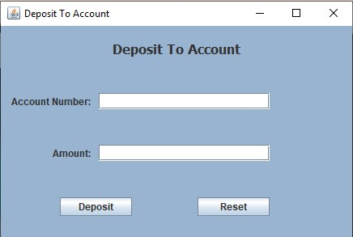
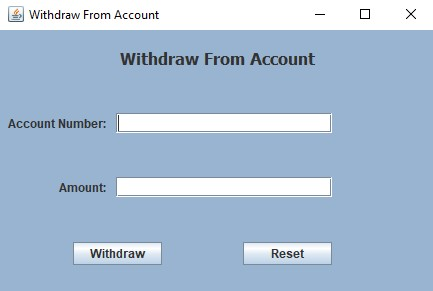
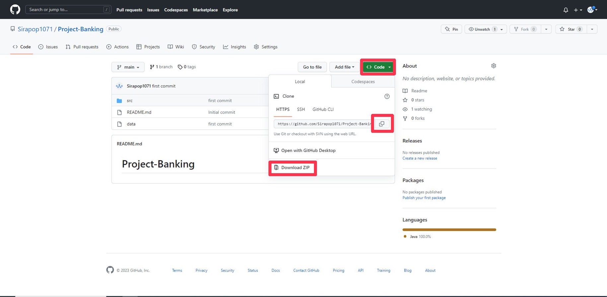
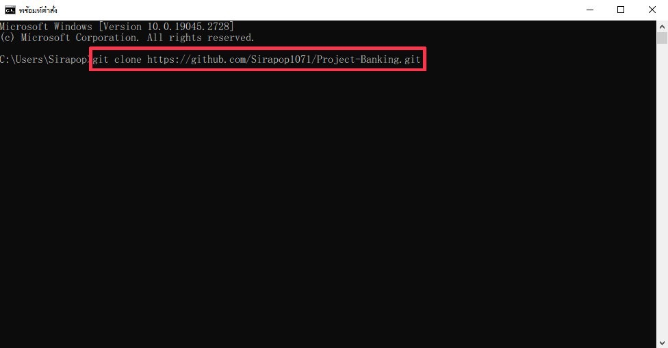

# Project-Banking
การใช้งานโปรแกรม 
===========  
 
ในส่วนของหน้า Login User = admin , Password = admin  

 
หน้า Menu เราสามารถเลือกได้ว่าจะใช้ฟังชั่นไหน  

 
ถ้าเลือก Add Account ก็จะมีให้เลือก 3 แบบ  

 
ยกตัวอย่างเลือกแบบ SavingsAccount  

 
DisplayList สามารถใช้ดูหลงจากเราAdd Accountเรียบร้อยแล้ว สามมารถใช้ดูเลขID เพื่อใช้สำหรับ ฝากและถอนเงิน  

 
Deposit ==> ช่องด้านใส่ใช้สำหรับใส่ ID / ช่องด้านล่างสำหรับใส่จำนวนเงินที่ต้องการฝาก  

 
Withdraw ==> ช่องด้านใส่ใช้สำหรับใส่ ID / ช่องด้านล่างสำหรับใส่จำนวนเงินที่ต้องการถอน  

วิธีการติดตั้ง 
========  
 
เลือกที่ Code แล้วสามารถเลือกดาวน์โหลดแบบ ZIP หรือจะก็อปลิงค์ไปโหลดผ่าน cmd ก็ได้  

 
ถ้าเลือกก็อปโค้ด ให้ใช้คำสั่ง git clone <ลิงค์ที่ก็อปมา>    
*ถ้าจะใช้git clone ต้องดาวน์โหลด git มาก่อนนะครับ https://git-scm.com/downloads
