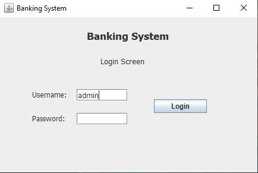
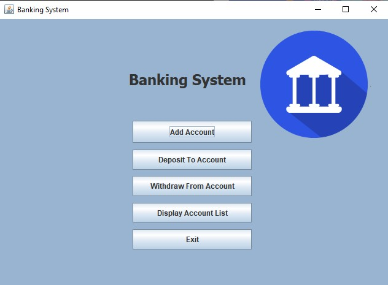
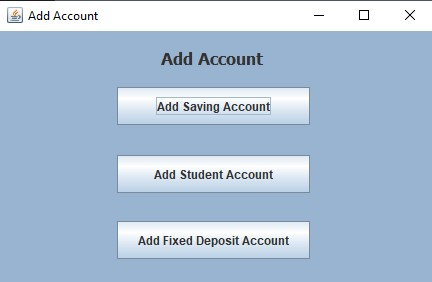
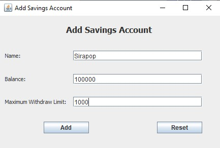
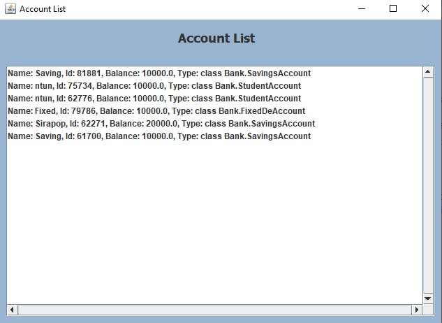

# Project-Banking
การใช้งานโปรแกรม 
 
ในส่วนของหน้า Login User = admin , Password = admin

 
หน้า Menu เราสามารถเลือกได้ว่าจะใช้ฟังชั่นไหน

 
ถ้าเลือก Add Account ก็จะมีให้เลือก 3 แบบ

 
ยกตัวอย่างเลือกแบบ SavingsAccount

 
DisplayList สามารถใช้ดูหลงจากเราAdd Accountเรียบร้อยแล้ว สามมารถใช้ดูเลขID เพื่อใช้สำหรับ ฝากและถอนเงิน

